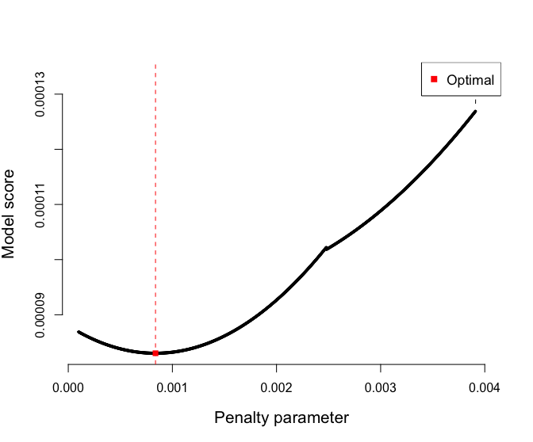
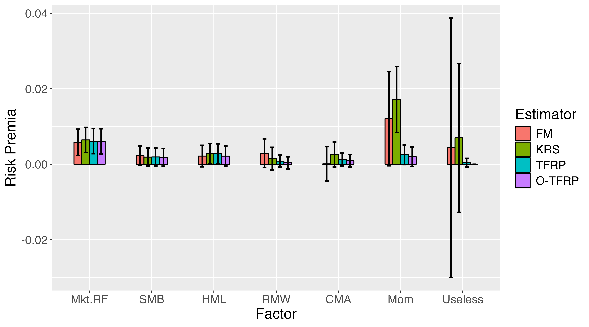

# intrinsicFRP: An R Package for Factor Model Asset Pricing

<!-- badges: start -->
[](https://CRAN.R-project.org/package=intrinsicFRP)
[](https://www.gnu.org/licenses/gpl-3.0)
[](https://github.com/a91quaini/intrinsicFRP/actions/workflows/R-CMD-check.yaml)
[](https://app.codecov.io/gh/a91quaini/intrinsicFRP)
[](https://CRAN.R-project.org/package=intrinsicFRP)
<!-- badges: end -->

Author: Alberto Quaini

## Description

The `intrinsicFRP` library implements **functions designed for comprehensive evaluation and testing of linear asset pricing models**, focusing on the estimation and assessment of factor risk premia, selection of "useful" risk factors (those displaying non-zero population correlation with test asset returns), examination of model misspecification, validation of model identification, and heteroskedasticity and autocorrelation robust covariance matrix estimation.

Given $T$ observations on $N$ test asset excess returns collected in matrix 
$R\in\mathbb R^{TxN}$,
and $T$ observations on $K$ risk factors in $F\in\mathbb R^{TxK}$, 
consider the linear asset pricing model:
$$R - \iota_T * E[R_t]' = (F - \iota_T * E[F_t]')\beta + \varepsilon,$$
where $\iota_T\in\mathbb R^T$ is a unit vector, $E[R_t]\in\mathbb R^N$ and 
$E[F_t]\in\mathbb R^K$ are the vector of expected returns and factors, respectively, 
$\beta\in\mathbb R^{NxK}$ is the matrix of regression coefficients,
and $\varepsilon\in\mathbb R^{TxN}$ is a matrix of residuals.

### Factor risk premia

The vector of compensations for risk factor exposures $\lambda\in\mathbb R^K$,
i.e., factor risk premia, are determined by the second-stage regression of expected
asset returns on regression coefficients:
$$E[R_t] = \beta\lambda + \nu,$$
where $\nu\in\mathbb R^N$ is the vector of model's pricing errors. 

For **estimating and testing factor risk premia**, our toolkit incorporates the classic two-pass approach outlined by [@fama1973risk], the misspecification-robust methodology proposed by [@kan2013pricing], and the tradable and "Oracle" tradable approaches introduced by [@quaini2023tradable].

The classic two-pass factor risk premia are given by:
$$\lambda=(\beta'\beta)^{-1}\beta'E[R_t].$$
The misspecification-robust factor risk premia are given by:
$$\lambda=(\beta'W\beta)^{-1}\beta'WE[R_t],$$
where $W$ is a symmetric and positive definite weighting matrix.
The tradable factor risk premia are given by:
$$\lambda=Cov[R_t,F_t]Var[R_t]^{-1}E[R_t].$$
Details on the motivations and properties of these notions of factor risk premia
are found in the aforementioned references.

### Factor selection

Many problems arise when some factors are useless or weak, that is, when their
population correlations with test asset excess returns are zero or near-zero,
or more generally when the matrix collecting such population correlations is
reduced-rank. In that case, the matrix of regression coefficients $\beta$ is also
reduced rank, thereby the vector of factor risk premia $\lambda$ is not identified.
This lack of identification has serious repercussions in its estimation and inference.
It is therefore important to filter out the problematic factors from the model.

For **selecting the set of useful risk factors**, our toolkit implements the 
iterative factor screening procedure of [@gospodinov2014misspecification]
and the one-step Oracle selection procedure of [@quaini2023tradable].

Consider a linear SDF in the factors:
$$M_t=1-\gamma'(F_t-E[F_t])$$
where 
$\gamma=(Cov[F_t,R_t]Var[R_t]^{-1}Cov[R_t,F_t])^{-1}Cov[F_t,R_t]Var[R_t]^{-1}E[R_t]$
are the SDF coefficients minimizing following quadratic form in the SDF pricing errors
$E[R_tM_t]$:
$$\gamma=\arg\min_{g\in\mathbb R^K}E[R_tM_t]'Var[R]^{-1}E[R_tM_t].$$
The screening procedure of [@gospodinov2014misspecification] is based on the result
that the asymptotic distribution of misspecification-robust t-statistics of the SDF coefficients are $\chi^2(1)$, Chi-squared with one degree of freedom,
for the coefficients of useless factors, and they are stochastically dominated by
a $\chi^2(1)$ for the useful factors. With this motivation, they suggest a sequential removal of factors associated with the smallest insignificant t-statistics of a nonzero misspecification-robust SDF coefficient. Note that this procedure 
gives rise to a conservative factor selection, it
requires a correction for the multiple testing problem, and it is only robust to the
presence of useless factors, and not to weak factors or more general linear dependence
structures in the population correlation matrix between test asset returns and
risk factors.

The screening methodology in [@quaini2023tradable] removes the factors associated to a zero Oracle tradable factor risk premia estimates, which arise from the one-step 
closed-form estimator:
$$\check{\lambda}_k = sign(\hat\lambda_k)\max\{|\hat{\lambda}_k|-\tau/||\rho_k||_2^2,0\},$$
where $\hat{\lambda}=\widehat{Cov}[R_t,F_t]\widehat{Var}[R_t]^{-1}\widehat{E}[R_t]$ is the sample
tradable factor risk premia estimator, which simply replaces population moments with
empirical moments, $\tau$ is a penalty parameter that can be tuned via, e.g., cross validation, and $\rho_k=\widehat{Corr}[F_{tk}, R_t]$ is the estimated correlation
between factor $k$ and test asset excess returns.
Borrowing the terminology of [@fan2001variable],
this procedure achieves the so-called "Oracle" variable selection property, 
i.e., it consistently selects the useful factors. More precisely, the
probability that the factors selected by the estimator are indeed useful factors
tends to 1 as the sample size tends to infinity.

### Model misspecification distance

For **evaluating model misspecification**, the toolkit implements point and 
confidence interval estimation for the HJ model misspecification distance 
formulated by [@kan2008specification], 
which is a modification of the prominent Hansen-Jagannathan misspecification 
distance of [@hansen1997assessing]. 
Such (squared) distance $\delta_m^2$ is given by the minimum quadratic form in the
model pricing errors, weighted by the inverse variance of test asset excess returns:
$$\delta_m^2 = min_{\gamma\in\mathbb R^k} (E[R_t] - Cov[R_t,F_t] * \gamma)' * V[R_t]^{-1} * (E[R_t] - Cov[R_t,F_t] * \gamma).$$
Clearly, computation of the confidence interval is obtained by means of an
asymptotic analysis under potentially misspecified models, i.e.,
without assuming correct model specification.

### Model identification test

Lastly, the functions for **testing model identification** are specialized versions of the rank tests proposed by [@kleibergen2006generalized] and [@chen2019improved]. These tests are specifically tailored to assess the regression coefficient matrix of test asset returns on risk factors.

Factor risk premia $\lambda$, equivalently SDF coefficients $\gamma$, 
are identified if the population correlation matrix between test asset excess returns 
and risk factors, or equivalently the regression coefficient
matrix $\beta$, is full column rank. The beta rank test of [@kleibergen2006generalized]
is a procedure that tests the Null hypothesis 
$$H_0:rank(\beta)=q$$
iteratively for $q=0,\ldots,K-1$. 
It therefore requires a correction for multiple testing.
Instead, the beta rank test of [@chen2019improved] is a bootstrap-based procedure
designed to test directly the Null hypothesis 
$$H_0:rank(\beta)<= K-1.$$

### HAC covariance estimation

For **heteroskedasticity and autocorrelation robust covariance matrix estimation**
of a centred time series $q_t\in\mathbb R^M$, with $M\ge 1$,
the package implements the [@newey1994automatic] estimator.
This estimator aims at computing:
$$\lim_{T\to\infty}\frac{1}{T}\sum_{t=1}^T\sum_{s=1}^TE[q_tq_s'],$$
by estimating the cross-moments $E[q_tq_s']$ up to an appropriate number of lags
$l=|t-s|$. 
This estimator is frequently used, e.g., for a robust estimation of the
covariance matrix of the model's pricing errors $\varepsilon_t$.
  
## Citation

To cite `intrinsicFRP` in publications, please use:

> Quaini, A. (2023). `intrinsicFRP`: An R Package for Factor Model Asset Pricing. `R` package version 2.0.0. URL: https://CRAN.R-project.org/package=intrinsicFRP.

## Installation

### Building from CRAN

Package `intrinsicFRP` is on CRAN (The Comprehensive R Archive Network),
hence the latest release can be easily installed from the `R` command
line via

```R
install.packages("intrinsicFRP")
```

### Building from source

To install the latest (possibly unstable) development version from
GitHub, you can pull this repository and install it from the `R` command
line via

```R
# if you already have package `devtools` installed, you can skip the next line
install.packages("devtools")
devtools::install_github("a91quaini/intrinsicFRP")
```

Package `intrinsicFRP` contains `C++` code that needs to be
compiled, so you may need to download and install the [necessary tools
for MacOS](https://cran.r-project.org/bin/macosx/tools/) or the
[necessary tools for
Windows](https://cran.r-project.org/bin/windows/Rtools/).

## Features

### Functions

R package `intrinsicFRP` implements the following functions:

- `FRP()`: Computes the [@fama1973risk] factor risk premia: `FMFRP = (beta' * beta)^{-1} * beta' * E[R]` where `beta = Cov[R, F] * V[F]^{-1}` or the misspecification-robust factor risk premia of [@kan2013pricing]: `KRSFRP = (beta' * V[R]^{-1} * beta)^{-1} * beta' * V[R]^{-1} * E[R]`, from data on factors `F` and test asset excess returns `R`. These notions of factor risk premia are by construction the negative covariance of factors `F` with candidate SDF `M = 1 - d' * (F - E[F])`, where SDF coefficients `d` are obtained by minimizing pricing errors: `argmin_{d} (E[R] - Cov[R,F] * d)' * (E[R] - Cov[R,F] * d)` and `argmin_{d} (E[R] - Cov[R,F] * d)' * V[R]^{-1} * (E[R] - Cov[R,F] * d)`, respectively. Optionally computes the corresponding heteroskedasticity and autocorrelation robust standard errors using the [@newey1994automatic] plug-in procedure to select the number of relevant lags, i.e., `n_lags = 4 * (n_observations/100)^(2/9)`. For the standard error computations, the function allows to internally pre-whiten the series by fitting a VAR(1), i.e., a vector autoregressive model of order 1. All the details can be found in [@kan2013pricing].
- `TFRP()`: Computes tradable factor risk premia from data on factors `F` and test asset excess returns `R`: `TFRP = Cov[F, R] * Var[R]^{-1} * E[R]`; which are by construction the negative covariance of factors `F` with the SDF projection on asset returns, i.e., the minimum variance SDF. Optionally computes the corresponding heteroskedasticity and autocorrelation robust standard errors using the [@newey1994automatic] plug-in procedure to select the number of relevant lags, i.e., `n_lags = 4 * (n_observations/100)^(2/9)`. For the standard error computations, the function allows to internally pre-whiten the series by fitting a VAR(1), i.e., a vector autoregressive model of order 1. All details are found in [@quaini2023tradable].
- `OracleTFRP()`: Computes Oracle tradable factor risk premia of [@quaini2023tradable] 
from data on
 `K` factors `F = [F_1,...,F_K]'` and test asset excess returns `R`:
 `OTFRP = argmin_x ||TFRP - x||_2^2 + tau * sum_{k=1}^K w_k * |x_k|`,
 where `TFRP` is the tradable factor risk premia estimator, `tau > 0` is a
 penalty parameter, and the Oracle weights are given by
 `w_k = 1 / ||corr[F_k, R]||_2^2`.
 This estimator is called "Oracle" in the sense that the probability that
 the index set of its nonzero estimated risk premia equals the index set of
 the true strong factors tends to 1 (Oracle selection), and that on the strong
 factors, the estimator reaches the optimal asymptotic Normal distribution.
 Here, strong factors are those that have a nonzero population marginal
 correlation with asset excess returns.
 Tuning of the penalty parameter `tau` is performed via Generalized Cross
 Validation (GCV), Cross Validation (CV) or Rolling Validation (RV).
 GCV tunes parameter `tau` by minimizing the criterium:
 `||PE(tau)||_2^2 / (1-df(tau)/T)^2`
 where
 `PE(tau) = E[R] - beta_{S(tau)} * OTFRP(tau)`
 are the pricing errors of the model for given tuning parameter `tau`,
 with `S(tau)` being the index set of the nonzero Oracle TFRP computed with
 tuning parameter `tau`, and
 `beta_{S(tau)} = Cov[R, F_{S(tau)}] * (Cov[F_{S(tau)}, R] * V[R]^{-1} * Cov[R, F_{S(tau)}])^{-1}`
 the regression coefficients of the test assets excess returns on the
 factor mimicking portfolios,
 and `df(tau) = |S(tau)|` are the degrees of freedom of the model, given by the
 number of nonzero Oracle TFRP.
 CV and RV, instead, choose the value of `tau` that minimize the criterium:
 `PE(tau)' * V[PE(tau)]^{-1} PE(tau)`
 where `V[PE(tau)]` is the diagonal matrix collecting the marginal variances
 of pricing errors `PE(tau)`, and each of these components are
 aggregated over k-fold cross-validated data or over rolling windows of data,
 respectively.
 Oracle weights can be based on the correlation between factors and returns
 (suggested approach),
 on the regression coefficients of returns on factors or on the first-step
 tradable risk premia estimator. Optionally computes the corresponding
 heteroskedasticity and autocorrelation robust standard errors using the
 [@newey1994automatic] plug-in procedure to select the number
 of relevant lags, i.e., `n_lags = 4 * (n_observations/100)^(2/9)`.
 For the standard error computations, the function allows to internally
 pre-whiten the series by fitting a VAR(1),
 i.e., a vector autoregressive model of order 1.
 All details are found in [@quaini2023tradable].
- `ChenFang2019BetaRankTest()`: Tests the null hypothesis of reduced rank in the matrix of regression
 loadings for test asset excess returns on risk factors using the [@chen2019improved]
 beta rank test. The test applies the [@kleibergen2006generalized]
  iterative rank test
 for initial rank estimation when `target_level_kp2006_rank_test > 0`, with an
 adjustment to `level = target_level_kp2006_rank_test / n_factors`. When
 `target_level_kp2006_rank_test <= 0`, the number of singular values above
 `n_observations^(-1/4)` is used instead. It presumes that the number of factors
 is less than the number of returns (`n_factors < n_returns`).
 All the details can be found in [@chen2019improved].
- `IterativeKleibergenPaap2006BetaRankTest()`: Evaluates the rank of regression loadings in an asset pricing model using the
 iterative [@kleibergen2006generalized] beta rank test.
 It systematically tests the null hypothesis
 for each potential rank `q = 0, ..., n_factors - 1` and estimates the rank as the smallest `q`
 that has a p-value below the significance level, adjusted for the number of factors.
 The function presupposes more returns than factors (`n_factors < n_returns`).
 All the details can be found in [@kleibergen2006generalized].
- `HACcovariance()`: estimates the long-run covariance matrix of a multivariate centred time series accounting for heteroskedasticity and autocorrelation using the [@newey1994automatic] estimator. If the number of lags is not provided, they are selected using the Newey-West plug-in procedure, where `n_lags = 4 * (n_observations/100)^(2/9)`. The function allows to internally prewhiten the series by fitting a VAR(1). All the details can be found in [@newey1994automatic].
  
For usage details, type `?FunctionName` in the R console, e.g.:

```R
?TFRP
```

## Data

The `intrinsicFRP` R package includes a dataset comprising following
test asset excess returns and risk factors frequently used 
in the asset pricing literature:

- `returns`: Monthly observations from January 1970 to December 2021, containing excess returns data for 25 Size/Book-to-Market portfolios and 17 industry portfolios.
- `factors`: Monthly observations from January 1970 to December 2021, containing data for the Fama-French 5 factors and the momentum factor.

This dataset was sourced from the [Kenneth French data library](https://mba.tuck.dartmouth.edu/pages/faculty/ken.french/data_library.html)
and processed so that the observations on the test assets and the factors are not
expressed in percentage points, and that returns on the test assets are in excess 
of the risk-free rate.

## Examples

## Real data example 1: estimation and inference of factor risk premia

Let us ompute various factor risk premia estimates and corresponding 95% confidence intervals for the Fama-French 6 factors and a (simulated) "useless" factor.

```R
# import package data on 6 risk factors and 42 test asset excess returns
# remove the first column containing the date
factors = intrinsicFRP::factors[,-1]
returns = intrinsicFRP::returns[,-1]

# simulate a useless factor and add it to the matrix of factors
set.seed(23)
factors = cbind(
  factors,
  stats::rnorm(n = nrow(factors), sd = stats::sd(factors[,3]))
)
colnames(factors) = c(colnames(intrinsicFRP::factors[,2:7]), "Useless")

# index set of specific factor models
# Fama-French 3 factor model
ff3 = 1:3
# Fama-French 6 factor model
ff6 = 1:6         # "Mkt-RF" "SMB" "HML" "RMW" "CMA" "Mom"
# model comprising the Fama-French 6 factors and the simulated useless factor
ff6usl = 1:7      # "Mkt-RF" "SMB" "HML" "RMW" "CMA" "Mom" "Useless"

# compute tradable factor risk premia and their standard errors
tfrp = intrinsicFRP::TFRP(returns, factors[,ff6usl], include_standard_errors = TRUE)

# compute the GLS factor risk premia of Kan Robotti and Shanken (2013) and their
# standard errors
krs_frp = intrinsicFRP::FRP(returns, factors[,ff6usl], include_standard_errors = TRUE)

# set penalty parameters
penalty_parameters = seq(1e-4, 4e-3, length.out = 1000)

# compute Oracle tradable factor risk premia and their standard errors
# for low factor models, no need for the "one standard deviation" tuning rule
oracle_tfrp = intrinsicFRP::OracleTFRP(
  returns,
  factors[,ff6usl],
  penalty_parameters,
  include_standard_errors = TRUE,
  one_stddev_rule = FALSE
)
```

<!--```R
# create dataframe
df <- data.frame(
  Factor = factor(
    rep(colnames(factors[,ff6usl]), 3),
    levels = colnames(factors[,ff6usl])
  ),
  Estimator = factor(
    rep(c("KRS-FRP", "TFRP", "O-TFRP"), each=ncol(factors[,ff6usl])),
    levels = c("KRS-FRP", "TFRP", "O-TFRP")
  ),
  risk_premia = c(krs_frp$risk_premia, tfrp$risk_premia, oracle_tfrp$risk_premia),
  standard_errors = c(
    krs_frp$standard_errors, tfrp$standard_errors, oracle_tfrp$standard_errors
  )
)

# Create the plot
ggplot2::ggplot(df, ggplot2::aes(
  x = as.factor(.data$Factor), y = .data$risk_premia, fill = .data$Estimator)) +
  ggplot2::theme(text=ggplot2::element_text(size=16)) +
  ggplot2::geom_bar(stat = "identity", position = "dodge", width=0.5, color="black") +
  ggplot2::labs(x = "Factor", y = "Risk Premia") +
  ggplot2::geom_errorbar(ggplot2::aes(
    x=as.factor(Factor),
    ymin=risk_premia - stats::qnorm(0.975) * standard_errors,
    ymax=risk_premia + stats::qnorm(0.975) * standard_errors),
    linewidth=.8, position = ggplot2::position_dodge(0.5), width = 0.25)

ggplot2::ggsave(
  "inst/examples/risk_premia.png",
  width = 7,
  height = 5,
  dpi=600
```-->

Tuning model score of the Oracle TFRP estimator:

<p float="left">

</p>

Visualization of the misspecification-robust factor risk premia (KRS-FRP), tradable factor risk premia (TFRP) and Oracle TFRP (O-TFRP) estimates:

<p float="left">

</p>

In this plot, we notice a number of features:

- The point estimates and associated confidence intervals
under the misspecification-robust and the tradable risk premia notions for
the market, SMB, HML and RMW factors are similar.
- The point estimates (confidence intervals) of the misspecification-robust risk premia for the RMW and CMA factors are mildly larger (wider) than the point estimates (confidence intervals) their corresponding tradable risk premia. 
- The point estimates (confidence intervals) of the misspecification-robust risk premia for the Mom and the simulated useless factor are much larger (wider) than the point estimates (confidence intervals) their corresponding tradable risk premia.
- The only factors featuring a confidence interval for misspecification-robust
(tradable) risk premium that does not include
zero is the market, CMA and Mom (market and Mom) factors.
- The Oracle factor risk premium of the simulated useless factor is exactly zero.

## Real data example 2: factor screening

Let us now focus on the factor screening procedures under the Oracle TFRP estimator
and the approach of [@gospodinov2014misspecification].

```R
# recover the indices of the factors selected by the Oracle TFRP estimator
which(oracle_tfrp$risk_premia != 0)

# compute the GKR factor screening procedure
intrinsicFRP::GKRFactorScreening(returns, factors[,ff6])
```

The results are:
```R
# factor indices of the factors selected by the Oracle TFRP estimator
[1] 1 2 3 4 5 6

# results of the GKR factor screening procedure
$sdf_coefficients
         [,1]
[1,] 3.136834

$standard_errors
        [,1]
[1,] 1.13246

$t_statistics
         [,1]
[1,] 2.769929

$selected_factor_indices
     [,1]
[1,]    1
```
While the Oracle TFRP only removes the simulated useless factor, the
procedure by [@gospodinov2014misspecification] only retains the market factor.

## Real data example 3: asset pricing models' misspecification distance

Let us compute the HJ misspecification distance of the Fama-French 3 and 6 factor models.

```R
# compute the HJ misspecification distance of the Fama-French 3 and 6 factor models
intrinsicFRP::HJMisspecificationDistance(returns, factors[,ff3])
intrinsicFRP::HJMisspecificationDistance(returns, factors[,ff6])
```

The result of the HJ misspecification distance is:
```R
# HJ misspecification test p-value for the Fama-French 3 factor model
$squared_distance
[1] 0.2488529

$lower_bound
[1] 0.1559376

$upper_bound
[1] 0.3417683

# HJ misspecification test p-value for the Fama-French 6 factor model
$squared_distance
[1] 0.1619658

$lower_bound
[1] 0.08727944

$upper_bound
[1] 0.2366521
```

Since the p-value of both HJ misspecification tests is below the standard thresholds of $10\%$, $5\%$ and $1\%$, we reject the Null that the Fama-French 3 and 6 factor models are correctly specified.

## Real data example 4: testing asset pricing models' identification

Let us compute the iterative [@kleibergen2006generalized] and the [@chen2019improved] beta rank identification tests for the Fama-French 6 factor model.

```R
# compute identification tests of the Fama-French 6 factor model
intrinsicFRP::IterativeKleibergenPaap2006BetaRankTest(returns, factors[,ff6])
intrinsicFRP::ChenFang2019BetaRankTest(returns, factors[,ff6])
```

The results of the identification tests for the Fama-French 6 factor model are:
```R
# output of the Iteraive Kleibergen Paap (2006) Beta Rank Test
$rank
[1] 6

$q
     [,1] [,2] [,3] [,4] [,5] [,6]
[1,]    0    1    2    3    4    5

$statistics
[1] 108162.2473  10291.4280   4710.5822   1015.9157    376.7892    112.8450

$pvalues
[1]  0.000000e+00  0.000000e+00  0.000000e+00 3.510246e-143  2.062222e-41
[6]  1.340701e-09

# p-value of the Chen Fang (2019) Beta Rank Test
$statistic
[1] 143.1936

$`p-value`
[1] 0
```

Since the largest p-value of the Iteraive [@kleibergen2006generalized] Beta Rank Test and the p-value of the [@chen2019improved] Beta Rank Test are below the standard thresholds of $10\%$, $5\%$ and $1\%$, we reject the Null that the Fama-French 6 factor model is not identified.

For sanity check, let us compute the same identification tests for the unidentified model comprising the Fama-French 6 factors and a (simulated) "useless" factor.

```R
# compute identification tests of unidentified factor model comprising the
# Fama-French 6 factors and the simulated useless factor
intrinsicFRP::IterativeKleibergenPaap2006BetaRankTest(returns, factors[,ff6usl])
intrinsicFRP::ChenFang2019BetaRankTest(returns, factors[,ff6usl])
```

The results are:
```R
# output of the Iteraive Kleibergen Paap (2006) Beta Rank Test
$rank
[1] 6

$q
     [,1] [,2] [,3] [,4] [,5] [,6] [,7]
[1,]    0    1    2    3    4    5    6

$statistics
[1] 128024.51364  11595.52592   5480.53412   1127.71644    475.16366
[6]    190.55705     57.75449

$pvalues
[1]  0.000000e+00  0.000000e+00  0.000000e+00 7.265767e-147  1.346504e-45
[6]  3.134998e-12  1.216120e-02

# p-value of the Chen Fang (2019) Beta Rank Test
$statistic
[1] 41.87344

$`p-value`
[1] 0.188
```

Since the largest p-value of the Iteraive [@kleibergen2006generalized] Beta Rank Test and the p-value of the [@chen2019improved] Beta Rank Test are above the standard thresholds of $10\%$, $5\%$ and $1\%$, we do not reject the Null that the Fama-French 6 factor model augmented with a simulated useless factor is not identified.

## Dependencies

To optimize computational performance, all methods implemented in package `intrinsicFRP` are written in C++ and make use of the [Armadillo](https://arma.sourceforge.net/) [@sanderson2016armadillo] library for efficient linear algebra calculations. However, for user convenience, the interface of package `intrinsicFRP` is entirely implemented in R, with minimal dependencies, including:

- `Rcpp` [@eddelbuettel2018extending] and `RcppArmadillo` [@eddelbuettel2014rcpparmadillo]: They facilitate seamless integration between R, C++, and the armadillo C++ library.
- `graphics`: It provides R functions for creating basic graphics.

## Issues, bug reports, contributions, further help

You can raise issues, report bugs, seek for further help, or submit your contribution to the R package `intrinsicFRP` at the
github repository [a91quaini/intrinsicFRP](https://github.com/a91quaini/intrinsicFRP). 

For bug reports, you are kindly asked to make a small and self-contained program which exposes the bug.

## References
